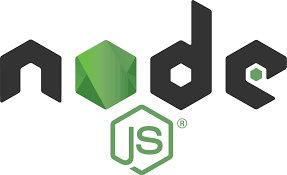

# MERN-Stack-Reference

## What is MERN Stack ?

MERN Stack is a collection of powerful technologies and robust, used to develop scalable master web applications comprising backend, front-end, and database components.

 It is JavaScript that is used for the faster and easier development of full-stack web applications. 
 
 MERN Stack is a technology that is a user-friendly full-stack JavaScript framework for building applications and dynamic websites.

## Documentation Link
 

<li><strong><a href="https://github.com/mongodb/node-mongodb-native">MongoDB</a></strong>: A cross-platform document-oriented database program</li>
<li><strong><a href="https://expressjs.com/en/4x/api.html">Express.js</a></strong>: A web application framework for Node.js</li>
<li><strong><a href="https://github.com/facebook/react">React</a></strong>: JavaScript library for building user interfaces</li>
<li><strong><a href="https://nodejs.dev/en/learn/introduction-to-nodejs/">Node.js</a></strong>: An open source, cross-platform, JavaScript run-time environment that executes JavaScript code outside of a browser</li>
</ul>

## Why should we choose MERN Stack for building Mobile and Web applications?

**Cost-effective**:
- MERN (MongoDB, Express.js, React.js, and Node.js) technologies are used in MERN Stack is built on JavaScript which provide less cost investment with better output.

**SEO friendly**:
- SEO (Search Engine Optimization) friendly means that search engines can search each page on the website efficiently and easily, interpret and correlate the content effectively with the searched text and easily index it in their database.

**Better performance**:
- Better performance refers to the faster response between backend and front-end and database, which ultimately improves the website speed and yields better performance, thus providing a smooth user experience.

**Improves Security**: 
- It mainly concerns the security of applications generated using MERN; here web application security refers to various processes, methods or technologies used for protecting web servers and various web applications, such as APIs (Application user interface) from the attack by internet-based threats. 
- Generally, secured hosting providers can easily integrate applications created using the MERN stack. 
- For more or better security Mongo DB and Node.js security tools are also used.

**Provide the fastest delivery**:
- Any Web applications and mobile applications created by using MERN Stack are built much faster, which also helps to provide faster delivery to our clients.

**Provides faster Modifications**: 
- MERN stack technologies supports quick modifications as per the client's request in the mobile and web applications.

**Open Source**: 
- All the four technologies that are involved in MERN are open-source. 
- This feature allows developers to get solutions to queries that may evolve from the open portals during development. As a result, it will be ultimately beneficial for a developer.

**Easy to switch between client and server**: 
- MERN is very simple and fast because it is written in only one language. And also, it is very easy to switch between client and server.

## Architectural Structure of MERN Stack and its working ?

MERN has a 3-tier Architecture system mainly consisting of 3 layers -

These layers are as follows:

1. Web as front-end tier
2. Server as the middle tier
3. Database as backend tier

## MERN's Four Technologies role

## MongoDB :

- Mongo DB is the most popular NoSQL (NoSQL or Non Structured Query Language) database, an open-source document-oriented database.

- 'NoSQL' typically means a non-relational database that does not require a fixed schema or proper relational tables to store the necessary data in it.

- The storage format in which the data is stored is known as BSON, which stands for Binary JavaScript Object Notation; its binary structure encodes length and type of information, which allows it to be parsed much more quickly.

- MongoDB uses BSON when storing documents in collections.

- It allows a highly scalable and flexible document structure.

- It is very faster as compared to RDBMS due to its efficient storage and indexing techniques.

- In MongoDB, complex join operations are not available; hence, it cannot support complex transactions.

- MongoDB uses JavaScript for coding as a language which is one of the great advantages.

- It is Schemaless as any data stored which is stored in a separate document.

-  MongoDB is a NoSQL database that scales by adding more and more servers and increases productivity with its flexible document model.

> ### Features

- Schema-less Database
- Indexing
- Document Oriented 
- Faster
- Scalability
- High Performance
- Replication and High Available
- Aggregation
- Simple Environment Setup

## Express

- Express is a JavaScript server-side framework that runs within node.js used to build fast, maintainable, and robust productions web applications..

- It provides the developer with a platform to create and maintain robust servers.

- Express is used for building and designing web and mobile applications easily and quickly by providing server-side logic.

- It allows developers to spin up robust APIs (Application Programming Interface) and web servers much easier and simpler.

- Express makes robust web servers easier to organize your application's functionality with routing and middleware.

- It also adds helpful functionalities to Node.js HTTP (HyperText Transfer Protocol) objects.

> ### Features

- Based on HTTP methods and URLs, Express allows you to define the routes of your application.
  - [ Routing: describe code that needs to be run in response to any request received by a server ]

- To perform additional tasks and functions on any request and response, you can easily use various middleware modules present in Express.
  - [ Middleware: used to add functionalities or augment the behaviour of the webserver during the lifecycle of request or response in the form of code ]
  - Error can easily handle by using error handling middleware. 

- Express facilitates you to create a REST API (Representational State Transfer Application Programming Interface)
  - [ REST API: conforms to the constraints of REST architectural style, and it also allows for interaction with RESTful web services.]
  - Advantage of REST API is that it provides great flexibility; it uses HTTP requests to access and use data.
  
- The data flow into a website structure can easily facilitate by using the two template engines, EJS and Jade, provided by Express.

- Express has a gigantic suite of third-party add-ons so that developers can use it to provide better functionality, helps to increase the security level, and improve speed.

- ne can easily access it from anywhere and use it simultaneously on different systems, and very fast.

- With its built-in router, it promotes code reusability.

- Single-threaded and Asynchronous.
- biggest community for Node.js.

## React

- React is one of the most popular open-source front-end JavaScript libraries used for building Web applications UI developed by Facebook.

- It is not a JavaScript framework.

- It was first created by software engineer Jordan Walke, who works for Facebook.

- React was first deployed in the Facebook news feed.

- Prerequisites: you must download Node packages in your system with their latest versions. Also, you must have an understanding of HTML, CSS and JavaScript.

- React is also used for making a grip over the view layer for mobile and web applications.

- It allows us to create reusable UI ( User Interface ) components.

- It allows developers to create large web applications that can easily change the data of the page even without reloading the page.

- It is very fast, simple and scalable.

> ### Features

- Easy to Learn
- Simple
- Data Binding
- Native Approach
- Performance
- Testability

## Node.js

- node.js is an open-source server environment, and it is a cross-platform runtime environment for executing JavaScript code outside a browser.

- It is often used for building and developing numerous backend services like net applications, mobile applications.

- It may be a free ASCII text file platform and may be utilized by anybody.

- It is incredibly simple to urge started with it and may even be used for agile development and prototyping.

- It provides extremely ascendable and really quick services to the users.

- It is incredibly consistent and may be used as an ASCII text file cleaner.

- It continuously uses JavaScript; thus, it's ultimately helpful for a computer user to quickly create any net service or any net or mobile application.

- It provides a massive system for any ASCII text file library.

- It contains a Non-blocking or, can say, Asynchronous nature.

> ### Features
- Easy Scalability
- Fast 
- Easy to learn and debug code
- Real-time web apps
- Caching Advantage
- Data Streaming 
- Object-Oriented Approach
- Event-Driven
- Corporate Support